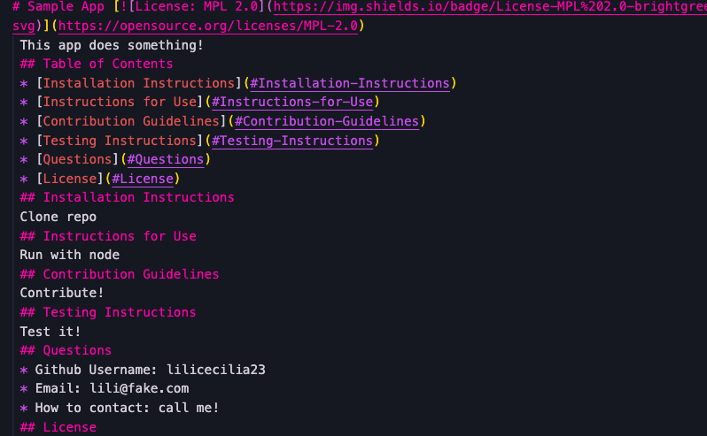
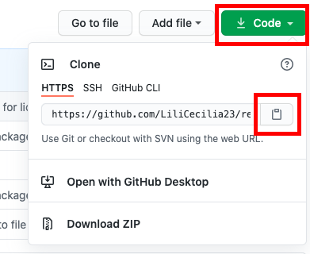
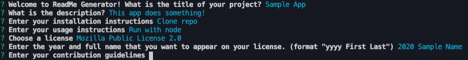
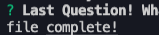
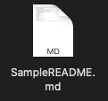

# readme-generator [](https://opensource.org/licenses/MIT)

This app uses node.js to generate a readme.md file based on the user's input to a series of prompts.



## Table of Contents
* [Installation](#Installation)
* [Usage Instructions](#Usage-Instructions)
* [License](#License)

## Installation
* Clone/fork files onto your local machine.

    

## Usage Instructions
1. Open terminal/git bash at the root folder (where index.js is stored on your computer).
2. Run ```node index.js```, then answer the prompts.

    

3. If successful, you'll see "file complete!" in your terminal.

    

4. At this point, a file named ```SampleREADME.md``` will have been created in your current directory which will have your answers to the prompts formatted into markdown.

    

5. Copy/move the ```SampleREADME.md``` into your project's directory and enjoy! 

## License
Copyright (c) 2020 Lili Clift Licensed under the MIT license.
